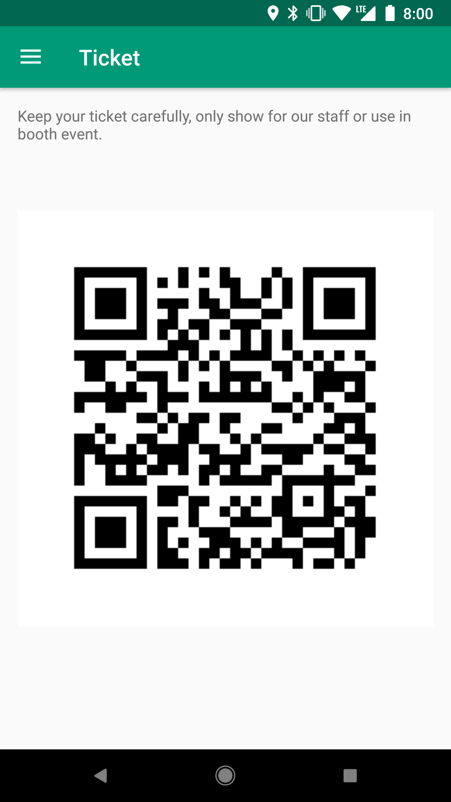

title: 我們把他拆了
output: index.html

--

<h1 style="font-size: 68px">
    我們把他拆了 
</h1>
 

## Denny Huang & 海豹

--

# 聲明

--

### Denny Huang

- Rayark Inc. Backend Engineer

- SITCON 共同發起人

### 海豹 (seadog007)

- 一枚高中生

- https://seadog007.me

--

  

--

  

--

  

--

 

  

--

 

  

--

 

  

--

 

  

--

 
 

  

--

 

  

--

 

  

--

  

--

  

--

 
<h1 style="font-size: 56px">
    https://github.com/CCIP-App/ 
</h1>

--

  

--

  

--

  

--

  

--

### 重點

- 伺服器驗證身份

- 伺服器紀錄集點歷程及兌換後註銷

- 由攤位掃與會者 QR Code 避免被建表

--

# Google Spreadsheet

--

### 重點

- 可行，雷亞也用很兇

- 注意權限，API 可以存取的資料使用者也能存取到

--

# SITCON 2018
## 2018 / 03 / 10 ＠  中央研究院人文社會館

--

<h1 style="font-size:72px">11 月 Call For Paper</h1>
<h2>
密切注意 SITCON <a href="https://www.facebook.com/groups/sitcon.tw/" target="_blank">FB社團</a> / <a href="https://www.facebook.com/SitconTW" target="_blank">粉絲團</a>
</h2>

--

# 歡迎與我們聯繫
<h2>
  <a href="mailto:contact@sitcon.org">contact@sitcon.org</a>
</h2>

--

<h1 style="font-size: 72px">
  Thanks for listening!
</h1>

   

  

<h2 style="font-size: 18px">
本投影片採用<a href="http://creativecommons.org/licenses/by-sa/3.0/tw/" target="_blank">創用 CC「姓名標示—相同方式分享 3.0 台灣」授權條款</a>
</h2>

